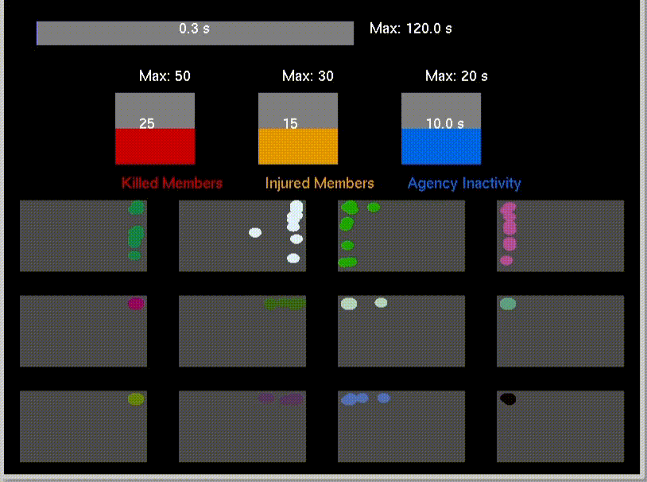

# Counter Espionage Agency Simulation

## ⚠️ THIS PROJECT HAS NEVER BEEN FINISHED, IT IS MISSING SOME FEATURES & HAS SOME BUGS ⚠️

## Overview
This project simulates a counter-espionage agency tasked with identifying and neutralizing spies infiltrating resistance groups. The simulation operates as an event-driven system where interactions between agency members, resistance groups, civilians, and enemies unfold dynamically. Implemented using multi-threading and multi-processing in Linux, the project ensures real-time decision-making and operational efficiency.

## System Structure
- *Counter Espionage Agency*: A single process manages multiple threads, each representing an agent.
- *Resistance Groups*: Each group functions as an independent process, with members represented as threads.
- *Civilians*: Exist as separate processes, some of whom may act as spies.
- *Enemy Forces*: A process that collects intelligence from spies and executes attacks on resistance groups.

## Functional Interactions
### Counter Espionage Agency
- Maintains a set number of operatives, replacing any who are killed, captured, or severely injured.
- Analyzes intelligence reports from resistance groups to identify potential spies.
- Arrests individuals based on suspicion levels, with confirmed spies removed from the simulation.
- Operatives can suffer casualties from enemy actions, requiring replacements.
- The longer an agent is in service, the greater their risk of being targeted by the enemy.
- Communication with resistance groups occurs through message queues.

### Resistance Groups
- Created at predefined intervals, each with a variable number of members.
- Can be military or civilian, with military groups facing a higher risk of infiltration.
- Each group may contain one spy at most.
- Regular interactions occur with civilians, who may gather intelligence.
- Groups are vulnerable to enemy attacks, leading to casualties or arrests.
- Injured members may recover based on injury severity and predefined recovery times.
- The longer a spy remains in a group, the higher the likelihood of an enemy attack.
- Reports are periodically sent to the agency regarding interactions and enemy attacks.

### Civilians & Spies
- Civilians interact with resistance members, learning critical information over time.
- Some civilians act as spies, passing intelligence to the enemy.
- Spies remain protected from severe injuries to maintain their cover.
- Civilians and suspected spies may be arrested by the agency based on predefined suspicion levels.

### Enemy Forces
- Receives reports from spies and strategizes attacks against resistance groups.
- Uses signals or shared memory to communicate attack events.
- Attacks may be targeted (specific individuals) or general (affecting entire groups).
- If a targeted member is arrested or dead before an attack reaches them, the attack is discarded.


## Termination Criteria
- A predefined number of resistance members are killed.
- A threshold of injured resistance members is reached.
- All counter-espionage agents are either killed or captured within a given time frame.

### **Compilation**

- To compile the project, use the `Makefile` provided. 

```bash
make
```

- To remove the compiled binary and perform a fresh build:
```bash
make clean
```
  - Ensures no residual artifacts from previous builds interfere with the current build.

### **3. Execution**
Run the main program with a configuration file:
```bash
./bin/main configuration.txt
```

## Issues

- **Minor Code Errors**: Some errors exist in the code that may cause unexpected behavior.

- **OpenGL Process Not Connected**: The OpenGL module is not properly connected to the main process and is not dynamically taking values from the simulation.

- **Visualization Issue**: The expected OpenGL visualization should dynamically adjust based on simulation events, but rendering issues prevent real-time updates.

  <div align="center">
    
</div>


